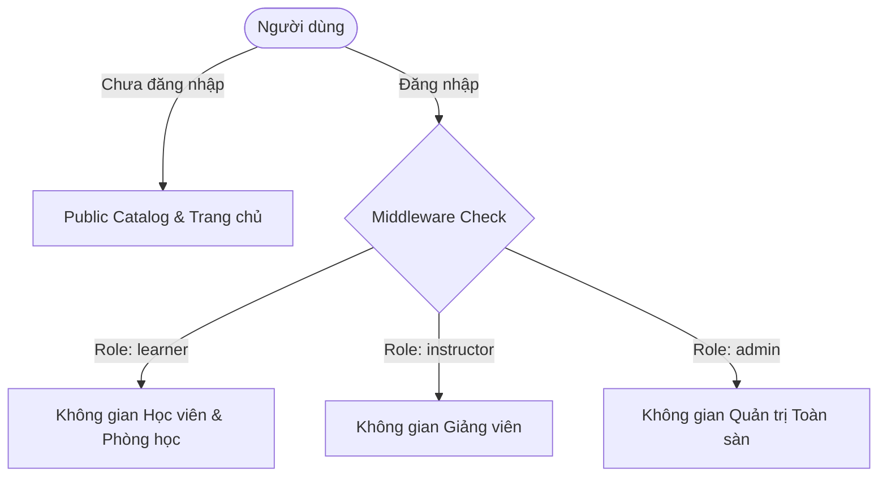
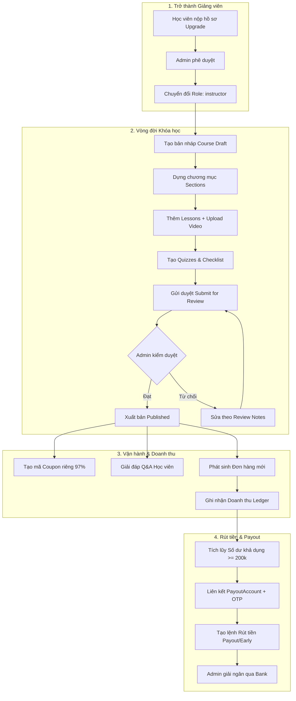

# 📋 BÁO CÁO CHI TIẾT TOÀN BỘ CHỨC NĂNG HỆ THỐNG MINDHUB (KÈM CODE & ĐIỀU KIỆN LỌC)

> **Hệ thống:** MindHub E-Learning & Marketplace Platform  
> **Phiên bản:** 2.0 (React 18 TypeScript + Laravel 11 API)  
> **Ngày cập nhật:** 18/08/2026  

---

## MỤC LỤC

1. [TỔNG QUAN KIẾN TRÚC & PHÂN QUYỀN HỆ THỐNG](#1-tổng-quan-kiến-trúc--phân-quyền-hệ-thống)
2. [PHÂN HỆ 1: XÁC THỰC & TÀI KHOẢN (AUTH & USER MANAGEMENT)](#2-phân-hệ-1-xác-thực--tài-khoản-auth--user-management)
3. [PHÂN HỆ 2: PUBLIC CATALOG & KHÁM PHÁ (DISCOVERY & SEARCH)](#3-phân-hệ-2-public-catalog--khám-phá-discovery--search)
4. [PHÂN HỆ 3: CHI TIẾT KHÓA HỌC & ĐÁNH GIÁ (COURSE DETAIL & REVIEWS)](#4-phân-hệ-3-chi-tiết-khóa-học--đánh-giá-course-detail--reviews)
5. [PHÂN HỆ 4: GIỎ HÀNG, KHUYẾN MÃI & THANH TOÁN (CART & PAYMENT)](#5-phân-hệ-4-giỏ-hàng-khuyến-mãi--thanh-toán-cart--payment)
6. [PHÂN HỆ 5: PHÒNG HỌC TRỰC TUYẾN & TIẾN ĐỘ HỌC (CLASSROOM & STREAMING)](#6-phân-hệ-5-phòng-học-trực-tuyến--tiến-độ-học-classroom--streaming)
7. [PHÂN HỆ 6: CÁ NHÂN HÓA HỌC VIÊN (LEARNER PERSONAL SPACE)](#7-phân-hệ-6-cá-nhân-hóa-học-viên-learner-personal-space)
8. [PHÂN HỆ 7: WORKSPACE GIẢNG VIÊN CHI TIẾT 6 LUỒNG NGHIỆP VỤ (INSTRUCTOR WORKSPACE)](#8-phân-hệ-7-workspace-giảng-viên-chi-tiết-6-luồng-nghiệp-vụ-instructor-workspace)
   - [8.1. Luồng 1: Đăng ký & Nâng cấp lên Giảng viên (Onboarding & Upgrade Request)](#81-luồng-1-đăng-ký--nâng-cấp-lên-giảng-viên-onboarding--upgrade-request)
   - [8.2. Luồng 2: Thiết lập Hồ sơ Chuyên môn & Bảo mật (Profile & Security)](#82-luồng-2-thiết-lập-hồ-sơ-chuyên-môn--bảo-mật-profile--security)
   - [8.3. Luồng 3: Vòng đời Khóa học & Trình dựng Đề cương (Course Lifecycle & Curriculum Builder)](#83-luồng-3-vòng-đời-khóa-học--trình-dựng-đề-cương-course-lifecycle--curriculum-builder)
   - [8.4. Luồng 4: Chiến lược Giá & Mã giảm giá Riêng (Pricing & Instructor Coupons - 97% Hoa hồng)](#84-luồng-4-chiến-lược-giá--mã-giảm-giá-riêng-pricing--instructor-coupons---97-hoa-hồng)
   - [8.5. Luồng 5: Quản lý Học viên & Tương tác Hỏi đáp (Learners & Q&A Interactions)](#85-luồng-5-quản-lý-học-viên--tương-tác-hỏi-đáp-learners--qa-interactions)
   - [8.6. Luồng 6: Quản lý Tài chính, Doanh thu & Rút tiền về Ngân hàng (Revenues & Withdrawals)](#86-luồng-6-quản-lý-tài-chính-doanh-thu--rút-tiền-về-ngân-hàng-revenues--withdrawals)
9. [PHÂN HỆ 8: WORKSPACE QUẢN TRỊ VIÊN (ADMIN WORKSPACE)](#9-phân-hệ-8-workspace-quản-trị-viên-admin-workspace)
10. [BẢNG TRA CỨU ROUTE FRONTEND & API BACKEND TƯƠNG ỨNG](#10-bảng-tra-cứu-route-frontend--api-backend-tương-ứng)

---

## 1. TỔNG QUAN KIẾN TRÚC & PHÂN QUYỀN HỆ THỐNG

MindHub phân quyền dữ liệu qua Middleware tầng Backend kết hợp Protected Routes tầng Frontend:



---

## 2. PHÂN HỆ 1: XÁC THỰC & TÀI KHOẢN (AUTH & USER MANAGEMENT)

### 🔹 Điều kiện lọc & Logic nghiệp vụ:
1. **Đăng nhập (`POST /api/auth/login`):**
   - Lọc user theo email và kiểm tra mật khẩu `Hash::check`.
   - **Điều kiện chặn:** User có `status != 'active'` hoặc `locked == 1` thì trả về lỗi 403 / 401.
2. **Cập nhật hồ sơ & Avatar (`PUT /api/users/profile`, `POST /api/users/avatar`):**
   - Chỉ sửa được thông tin của chính mình (`Auth::id()`).

### 💻 Code Backend thực tế:
```php
// Backend: AuthController.php
public function login(LoginRequest $request): JsonResponse
{
    $user = User::where('email', $request->email)->first();

    if (! $user || ! Hash::check($request->password, $user->password_hash)) {
        return ApiResponse::unauthorized('Email hoặc mật khẩu không đúng.');
    }

    if ($user->status === User::STATUS_LOCKED || $user->locked) {
        return ApiResponse::forbidden('Tài khoản của bạn đã bị khóa: ' . ($user->locked_reason ?? 'Liên hệ Admin.'));
    }

    $token = $user->createToken('mindhub_api_token')->plainTextToken;

    return ApiResponse::success([
        'token' => $token,
        'user'  => new UserResource($user),
    ], 'Đăng nhập thành công');
}
```

---

## 3. PHÂN HỆ 2: PUBLIC CATALOG & KHÁM PHÁ (DISCOVERY & SEARCH)

### 🔹 1. Phạm vi khóa học công khai (Public Scope)
* **Lọc theo gì:** Tất cả khóa học hiển thị công khai trên trang chủ, tìm kiếm, danh mục phải thỏa mãn:
  1. Khóa học có `status = 'published'` và chưa bị xóa mềm `deleted_at IS NULL`.
  2. Giảng viên của khóa học phải có `status = 'active'`, `deleted_at IS NULL`, và `locked = 0` (hoặc NULL).

### 💻 Code Backend Scope chung:
```php
// Backend: CatalogCourseRepository.php
private function publicCourseQuery(): Builder
{
    return Course::query()
        ->with(['instructor:id,full_name', 'categories'])
        ->where('courses.status', 'published')
        ->whereNull('courses.deleted_at')
        ->whereHas('instructor', function (Builder $instructorQuery) {
            $instructorQuery->where('users.status', 'active')
                ->whereNull('users.deleted_at')
                ->where(function (Builder $lockedQuery) {
                    $lockedQuery->whereNull('users.locked')
                                ->orWhere('users.locked', 0);
                });
        })
        ->select('courses.*')
        ->selectSub(function ($query) {
            $query->from('orders')
                ->join('course_reviews', 'course_reviews.order_id', '=', 'orders.id')
                ->whereColumn('orders.course_id', 'courses.id')
                ->whereNull('course_reviews.deleted_at')
                ->selectRaw('COALESCE(AVG(course_reviews.rating), 0)');
        }, 'average_rating')
        ->selectSub(function ($query) {
            $query->from('enrollments')
                ->whereColumn('enrollments.course_id', 'courses.id')
                ->whereIn('enrollments.status', ['active', 'completed'])
                ->selectRaw('COUNT(enrollments.id)');
        }, 'enrollments_count');
}
```

---

### 🔹 2. Bộ lọc Tìm kiếm Nâng cao (`GET /api/courses`)
* **Lọc theo các tham số (`filters`):**
  - **`search`:** Tìm kiếm mờ theo tiêu đề hoặc mô tả (`title LIKE %k% OR short_description LIKE %k%`).
  - **`category_id` / `category_slug`:** Lấy ID danh mục cha **và đệ quy toàn bộ danh mục con (`childIds`)**.
  - **`level`:** Lọc chính xác `level` (`beginner`, `intermediate`, `advanced`, `all_levels`).
  - **`min_price` / `max_price`:** Lọc theo giá thực tế sau giảm `COALESCE(sale_price, price)`.
  - **`sort`:** `latest`, `price_asc`, `price_desc`, `rating_desc`, `best_selling`, `featured`.

### 💻 Code Backend xử lý tìm kiếm & lọc:
```php
// Backend: CatalogCourseRepository.php
public function search(array $filters)
{
    $perPage = (int) ($filters['per_page'] ?? 10);
    $query = $this->publicCourseQuery();

    // 1. Lọc từ khóa
    if (! empty($filters['search'])) {
        $search = trim((string) $filters['search']);
        $query->where(function (Builder $q) use ($search) {
            $q->where('courses.title', 'like', "%{$search}%")
              ->orWhere('courses.short_description', 'like', "%{$search}%");
        });
    }

    // 2. Lọc danh mục (Bao gồm cả danh mục con)
    if (! empty($filters['category_id'])) {
        $categoryId = (int) $filters['category_id'];
        $categoryIds = [$categoryId];
        $childIds = Category::where('parent_id', $categoryId)->pluck('id')->toArray();
        if (! empty($childIds)) {
            $categoryIds = array_merge($categoryIds, $childIds);
        }

        $query->whereHas('categories', function (Builder $catQuery) use ($categoryIds) {
            $catQuery->whereIn('categories.id', $categoryIds)
                     ->where('categories.status', 'active')
                     ->whereNull('categories.deleted_at');
        });
    }

    // 3. Lọc theo trình độ
    if (! empty($filters['level'])) {
        $query->where('courses.level', $filters['level']);
    }

    // 4. Lọc theo khoảng giá thực tế
    if (isset($filters['min_price'])) {
        $query->whereRaw('COALESCE(courses.sale_price, courses.price) >= ?', [$filters['min_price']]);
    }
    if (isset($filters['max_price'])) {
        $query->whereRaw('COALESCE(courses.sale_price, courses.price) <= ?', [$filters['max_price']]);
    }

    // 5. Sắp xếp
    $this->applySort($query, $filters['sort'] ?? null);

    return $query->paginate($perPage);
}
```

---

### 🔹 3. Thuật toán Khóa học Nổi bật (Featured), Mới nhất (Latest) & Giảm giá (Discounted)
* **Khóa học Nổi bật (`/api/courses/featured`):**
  - Công thức Hybrid Score (40% lượt đăng ký gần đây / 40% tiến độ trung bình / 20% đánh giá sao trong 90 ngày).
* **Khóa học Giảm giá (`/api/home` $\rightarrow$ `discounted_courses`):**
  - Lọc `sale_price < price` và sắp xếp `% giảm giá cao nhất`.

### 💻 Code Backend xếp hạng:
```php
// Backend: CatalogCourseRepository.php

// 1. Featured Courses Ranking
public function featured(array $filters)
{
    $timeframe = now()->subDays(90);
    $eMax = max((float) DB::table('enrollments')
        ->where('enrolled_at', '>=', $timeframe)
        ->whereIn('status', ['active', 'completed'])
        ->groupBy('course_id')
        ->orderByDesc(DB::raw('COUNT(id)'))
        ->value(DB::raw('COUNT(id)')), 1.0);

    return $this->publicCourseQuery()
        ->selectSub(function ($q) use ($timeframe) {
            $q->from('enrollments')
              ->whereColumn('enrollments.course_id', 'courses.id')
              ->where('enrollments.enrolled_at', '>=', $timeframe)
              ->whereIn('enrollments.status', ['active', 'completed'])
              ->selectRaw('COUNT(enrollments.id)');
        }, 'recent_enrollments')
        ->selectSub(function ($q) use ($timeframe) {
            $q->from('enrollments')
              ->whereColumn('enrollments.course_id', 'courses.id')
              ->where('enrollments.enrolled_at', '>=', $timeframe)
              ->whereIn('enrollments.status', ['active', 'completed'])
              ->selectRaw('COALESCE(AVG(enrollments.progress_percent), 0)');
        }, 'recent_progress')
        ->orderByDesc('courses.is_featured')
        ->orderByRaw("
            IF(recent_enrollments >= 10,
                (0.4 * (recent_enrollments / $eMax)) + 
                (0.4 * (recent_progress / 100)) + 
                (0.2 * (average_rating / 5)),
                0
            ) DESC
        ")
        ->orderByDesc('enrollments_count')
        ->orderByDesc('average_rating')
        ->paginate($filters['per_page'] ?? 5);
}

// 2. Discounted Courses
public function discounted(array $filters)
{
    return $this->publicCourseQuery()
        ->whereNotNull('courses.sale_price')
        ->whereRaw('courses.sale_price < courses.price')
        ->orderByRaw('(courses.price - courses.sale_price) / courses.price DESC')
        ->orderByDesc('courses.published_at')
        ->paginate($filters['per_page'] ?? 5);
}
```

---

### 🔹 4. Tìm kiếm gợi ý nhanh 50/50 (`GET /api/search/suggestions`)
* **Lọc theo gì:** Chia đều limit kết quả: 50% Khóa học và 50% Danh mục.
* **Điều kiện:** Danh mục gợi ý **phải có ít nhất 1 khóa học đang published và giảng viên active**.

### 💻 Code Backend gợi ý:
```php
// Backend: CatalogCourseRepository.php
public function suggestions(string $keyword, int $limit = 10): Collection
{
    $courseLimit = (int) ceil($limit / 2);
    $categoryLimit = $limit - $courseLimit;

    $courses = DB::table('courses')
        ->join('users', 'users.id', '=', 'courses.instructor_id')
        ->where('courses.status', 'published')
        ->whereNull('courses.deleted_at')
        ->where('users.status', 'active')
        ->where(fn($q) => $q->whereNull('users.locked')->orWhere('users.locked', 0))
        ->where(fn($q) => $q->where('courses.title', 'like', "%{$keyword}%"))
        ->select(['courses.id', 'courses.title as text', 'courses.slug', DB::raw("'course' as type")])
        ->limit($courseLimit)->get();

    $categories = DB::table('categories')
        ->where('status', 'active')
        ->whereNull('deleted_at')
        ->where('name', 'like', "%{$keyword}%")
        ->whereExists(function ($q) {
            $q->selectRaw('1')->from('course_categories')
              ->join('courses', 'courses.id', '=', 'course_categories.course_id')
              ->join('users', 'users.id', '=', 'courses.instructor_id')
              ->whereColumn('course_categories.category_id', 'categories.id')
              ->where('courses.status', 'published')
              ->where('users.status', 'active');
        })
        ->select(['id', 'name as text', 'slug', DB::raw("'category' as type")])
        ->limit($categoryLimit)->get();

    return $courses->merge($categories)->take($limit)->values();
}
```

---

## 4. PHÂN HỆ 3: CHI TIẾT KHÓA HỌC & ĐÁNH GIÁ (COURSE DETAIL & REVIEWS)

### 🔹 Điều kiện lọc & Logic:
1. **Đề cương bài học (`GET /api/courses/{id}/curriculum`):**
   - Chỉ mở URL video cho bài học có `is_preview = true`. Bài học thường bị che giấu media URL nếu chưa đăng ký.
2. **Đánh giá khóa học (`GET /api/courses/{id}/reviews`):**
   - Lọc `reviews.rating IN (1,2,3,4,5)` nếu có filter; phân trang mới nhất.
   - **Viết đánh giá:** Kiểm tra `Order` có trạng thái `completed` và `user_id = Auth::id()`.

---

## 5. PHÂN HỆ 4: GIỎ HÀNG, KHUYẾN MÃI & THANH TOÁN (CART & PAYMENT)

### 🔹 Điều kiện lọc & Chia sẻ doanh thu:
1. **Áp dụng Mã giảm giá (`Coupon`):**
   - Điều kiện: `status = 'active'`, `start_at <= now() <= end_at`, `usage_count < usage_limit`, và `order_amount >= min_order_value`.
2. **Xử lý IPN VNPay Callback & Chia hoa hồng (`RevenueShareService`):**

### 💻 Code Backend chia sẻ hoa hồng:
```php
// Backend: RevenueShareService.php
public function calculateForOrder(Order $order): array
{
    $grossAmount = (float) ($order->final_amount ?? $order->amount ?? 0.0);
    $resolvedSource = $this->resolveSaleSource($order); // marketplace_default, instructor_coupon, platform_ads
    $ruleData = $this->resolveCommissionRule($resolvedSource);

    $instructorRate = (float) $ruleData['instructor_percent']; // 85% hoặc 97% hoặc 37%
    $platformRate = (float) $ruleData['platform_percent'];

    $instructorAmount = round($grossAmount * $instructorRate / 100, 2);
    $platformFeeAmount = round($grossAmount - $instructorAmount, 2);

    return [
        'sale_source' => $resolvedSource,
        'gross_amount' => $grossAmount,
        'instructor_amount' => $instructorAmount,
        'platform_fee_amount' => $platformFeeAmount,
    ];
}
```

---

## 6. PHÂN HỆ 5: PHÒNG HỌC TRỰC TUYẾN & TIẾN ĐỘ HỌC (CLASSROOM & STREAMING)

### 🔹 Điều kiện lọc & Bảo mật:
1. **Quyền vào học (`canAccessLesson` / `check-access`):**
   - Kiểm tra `Enrollment` có `user_id = Auth::id()`, `course_id = lesson.course_id`, `status IN ('active', 'completed')`.
2. **Stream Video Signed URL (`/learn/lessons/{id}/stream`):**
   - Middleware `signed` kiểm tra chữ ký URL điện tử + thời gian hết hạn (`temporarySignedRoute`).
3. **Cập nhật tiến độ (`/learn/lessons/{id}/progress`):**
   - Khi `progress_percent >= 80%`, đánh dấu bài học hoàn thành, tính lại % hoàn thành khóa học.

### 💻 Code Backend bảo mật bài học:
```php
// Backend: LearningController.php & LearningService.php
public function canAccessLesson(int $lessonId): bool
{
    $userId = Auth::id();
    $lesson = Lesson::findOrFail($lessonId);

    // Bài học preview miễn phí
    if ($lesson->is_preview) {
        return true;
    }

    // Kiểm tra học viên đã ghi danh
    return Enrollment::where('user_id', $userId)
        ->where('course_id', $lesson->course_id)
        ->whereIn('status', ['active', 'completed'])
        ->exists();
}
```

---

## 7. PHÂN HỆ 6: CÁ NHÂN HÓA HỌC VIÊN (LEARNER PERSONAL SPACE)

### 🔹 Điều kiện lọc:
* **Khóa học của tôi (`GET /api/me/courses`):**
  - Lọc theo `enrollments.user_id = Auth::id()`.
  - Tab **Đang học:** `progress_percent < 100`.
  - Tab **Đã hoàn thành:** `progress_percent = 100` hoặc `status = 'completed'`.

### 💻 Code Backend lọc khóa học của học viên:
```php
// Backend: StudentCourseRepository.php
public function getMyCourses(int $userId, array $filters)
{
    $query = Enrollment::with(['course.instructor'])
        ->where('user_id', $userId)
        ->whereIn('status', ['active', 'completed']);

    if (! empty($filters['status'])) {
        if ($filters['status'] === 'in_progress') {
            $query->where('progress_percent', '<', 100);
        } elseif ($filters['status'] === 'completed') {
            $query->where('progress_percent', '=', 100);
        }
    }

    return $query->orderByDesc('last_accessed_at')->paginate($filters['per_page'] ?? 10);
}
```

---

## 8. PHÂN HỆ 7: WORKSPACE GIẢNG VIÊN CHI TIẾT 6 LUỒNG NGHIỆP VỤ (INSTRUCTOR WORKSPACE)

Workspace Giảng viên (`/instructor/*`) là trung tâm quản lý toàn bộ vòng đời giảng dạy, học viên và tài chính.



---

### 8.1. Luồng 1: Đăng ký & Nâng cấp lên Giảng viên (Onboarding & Upgrade Request)

* **Bước 1 — Học viên gửi hồ sơ:**
  - Học viên vào `/profile` bấm **"Đăng ký làm Giảng viên"**.
  - Nhập thông tin: Tiêu đề chuyên môn (`headline`), Bio giới thiệu, Số năm kinh nghiệm, Đường dẫn CV / Bằng cấp chứng chỉ.
  - Gọi API: `POST /api/me/instructor-upgrade` (Trạng thái đơn: `pending`).
* **Bước 2 — Quản trị viên kiểm duyệt:**
  - Admin vào `/admin/instructor-upgrades` xem xét hồ sơ và ấn **"Phê duyệt"**.
  - Gọi API: `POST /api/admin/instructor-upgrades/{id}/approve`.
  - Backend tự động cập nhật `users.role = 'instructor'` và tạo bản ghi hồ sơ `InstructorProfile`.

---

### 8.2. Luồng 2: Thiết lập Hồ sơ Chuyên môn & Bảo mật (Profile & Security)

* **Quản lý thông tin giảng viên:**
  - `PATCH /api/instructor/profile/introduction` — Cập nhật Bio, mạng xã hội (LinkedIn, Github, Website).
  - `PATCH /api/instructor/profile/expertise` — Cập nhật lĩnh vực giảng dạy chuyên sâu và cấp độ (Junior, Senior, Lead).
  - `POST /api/instructor/profile/avatar` — Upload avatar đại diện với ảnh tối ưu.
* **Bảo mật & Phiên làm việc:**
  - `POST /api/instructor/profile/password/send-otp` $\rightarrow$ Nhận mã OTP qua email $\rightarrow$ `PATCH /api/instructor/profile/password` (Đổi mật khẩu bảo mật cao).
  - `GET /api/instructor/profile/sessions` & `DELETE /api/instructor/profile/sessions/others` — Xem và đăng xuất các phiên đăng nhập lạ trên thiết bị khác.

---

### 8.3. Luồng 3: Vòng đời Khóa học & Trình dựng Đề cương (Course Lifecycle & Curriculum Builder)

#### 🔹 Các bước thực hiện chi tiết:
1. **Tạo bản nháp Khóa học (`POST /api/instructor/courses/draft`):**
   - Nhập: Tiêu đề, Slug, Danh mục, Trình độ (`beginner`, `intermediate`, `advanced`), Ngôn ngữ, Giá bán (`price`), Giá khuyến mại (`sale_price`), Thumbnail và Video giới thiệu (`intro_video_url`).
   - Trạng thái khởi tạo: `status = 'draft'`.
2. **Xây dựng Cây Chương mục (`POST /api/instructor/sections`):**
   - Thêm các chương học (Ví dụ: "Chương 1: Cài đặt môi trường", "Chương 2: Cú pháp cơ bản").
   - Kéo thả sắp xếp thứ tự hiển thị (`sort_order`).
3. **Thêm Bài học & Upload Video (`POST /api/instructor/lessons`, `POST /api/instructor/lessons/{id}/video`):**
   - Loại bài học: `video`, `text`, `quiz`.
   - Gắn cờ học thử miễn phí: `is_preview = true` (Cho phép khách xem trước mà không cần mua).
   - Tải lên video bài giảng: Lưu vào **Private Storage**, backend tự động quét thời lượng video và cập nhật `duration_seconds` vào bài học.
   - Đính kèm tài liệu: `POST /api/instructor/lessons/{id}/assets` (Mã nguồn zip, tài liệu PDF).
4. **Tạo Bài tập Trắc nghiệm Quiz (`POST /api/instructor/quizzes`):**
   - Soạn thảo câu hỏi, các phương án lựa chọn, đáp án đúng, giải thích chi tiết và điểm chuẩn hoàn thành (`passing_score`).
5. **Kiểm tra Checklist điều kiện (`GET /api/instructor/courses/{id}/checklist`):**
   - Hệ thống tự động kiểm tra xem khóa học đã đủ điều kiện nộp duyệt chưa:
     - [x] Có ảnh thumbnail & Video intro.
     - [x] Có ít nhất 1 Section và tối thiểu 5 bài học.
     - [x] Tất cả bài học dạng video đã được upload file thành công.
6. **Gửi duyệt Khóa học (`POST /api/instructor/courses/{id}/submit`):**
   - Chuyển `status` từ `draft` sang `pending_approval`.
7. **Phản hồi kiểm duyệt từ Admin:**
   - Nếu Admin duyệt: Khóa học chuyển sang `published` $\rightarrow$ Xuất hiện công khai trên Marketplace.
   - Nếu Admin từ chối: Khóa học chuyển sang `rejected`, giảng viên xem lý do chỉnh sửa tại `GET /api/instructor/courses/{id}/review-notes` $\rightarrow$ Sửa xong nộp duyệt lại.

### 💻 Code Backend gửi duyệt khóa học:
```php
// Backend: InstructorCourseController.php
public function submitForReview(int $id): JsonResponse
{
    $course = Course::where('id', $id)
        ->where('instructor_id', Auth::id())
        ->firstOrFail();

    if ($course->status === 'published') {
        return ApiResponse::badRequest('Khóa học đã được xuất bản trước đó.');
    }

    // Kiểm tra checklist tối thiểu
    $lessonCount = Lesson::where('course_id', $course->id)->count();
    if ($lessonCount < 3) {
        return ApiResponse::badRequest('Khóa học phải có tối thiểu ít nhất 3 bài học trước khi gửi duyệt.');
    }

    $course->update([
        'status' => 'pending_approval',
        'updated_at' => now(),
    ]);

    return ApiResponse::success($course, 'Khóa học đã được gửi lên Ban quản trị để phê duyệt.');
}
```

---

### 8.4. Luồng 4: Chiến lược Giá & Mã giảm giá Riêng (Pricing & Instructor Coupons - 97% Hoa hồng)

* **Tạo mã giảm giá độc quyền:**
  - Giảng viên vào `/instructor/discount-codes` $\rightarrow$ Bấm **"Tạo mã mới"**.
  - Nhập: Mã Code (ví dụ: `THAYBA50`), Loại giảm giá (`percent` hoặc `fixed_amount`), Mức giảm, Ngày bắt đầu / kết thúc, Giới hạn số lượt dùng.
  - Áp dụng cho: Toàn bộ khóa học của giảng viên hoặc chọn 1 khóa học cụ thể.
  - API: `POST /api/instructor/coupons`.
* **Chính sách phân chia hoa hồng 97%:**
  - Khi học viên mua khóa học qua mã giảm giá của Giảng viên $\rightarrow$ Hệ thống tự động nhận diện `sale_source = 'instructor_coupon'`.
  - Giảng viên hưởng **97%** doanh thu sau giảm giá, Sàn chỉ thu **3%** phí hạ tầng/cổng thanh toán.

---

### 8.5. Luồng 5: Quản lý Học viên & Tương tác Hỏi đáp (Learners & Q&A Interactions)

* **Quản lý danh sách Học viên (`/instructor/students`):**
  - Xem danh sách toàn bộ học viên đã đăng ký khóa học (`GET /api/instructor/learners`).
  - Lọc theo khóa học, tìm kiếm theo tên/email, xem tiến độ học (`progress_percent`), ngày ghi danh và ngày truy cập gần nhất.
* **Hỏi đáp & Giải đáp thắc mắc Q&A (`/instructor/questions`):**
  - Lọc danh sách câu hỏi: Chưa trả lời (`pending`), Đã trả lời (`answered`), Gắn sao quan trọng (`starred`), Lọc theo từng khóa học.
  - Trả lời bài giảng: `POST /api/instructor/questions/{id}/reply` $\rightarrow$ Hệ thống tự động gửi thông báo đến học viên.
  - Quản trị nội dung: Ẩn bình luận spam/tiêu cực (`PATCH /api/instructor/questions/{id}/hide`).

---

### 8.6. Luồng 6: Quản lý Tài chính, Doanh thu & Rút tiền về Ngân hàng (Revenues & Withdrawals)

#### 🔹 1. Báo cáo & Bảng kê Doanh thu (Revenues Ledger):
* **Tổng quan doanh thu (`GET /api/instructor/revenues/summary`):**
  - Tổng doanh thu gộp (`total_gross_amount`).
  - Doanh thu thực nhận của giảng viên (`total_instructor_amount`).
  - Phí sàn đã đóng (`total_platform_fee_amount`).
* **Bảng kê chi tiết từng đơn hàng (`GET /api/instructor/revenues/details`):**
  - Hiển thị từng giao dịch: Mã đơn, tên khóa học, giá thanh toán, nguồn bán (`Marketplace` / `Coupon`), % hoa hồng và số tiền thực nhận.

#### 🔹 2. Liên kết Tài khoản Ngân hàng (`PayoutAccount`):
* Giảng viên vào mục **Cài đặt thanh toán** $\rightarrow$ Thêm thông tin:
  - Tên Ngân hàng (Vietcombank, Techcombank, MB Bank, ACB...).
  - Số tài khoản ngân hàng & Tên chủ tài khoản (viết hoa không dấu).
  - Xác thực bảo mật: Gửi OTP qua email để kích hoạt tài khoản `POST /api/instructor/payout-accounts/{id}/send-change-otp`.

#### 🔹 3. Quy trình Rút tiền về Ngân hàng (Withdrawal Flow):
* **Điều kiện tạo lệnh:**
  $$\text{Available Balance} \ge 200.000 \text{ VNĐ} \quad \text{VÀ Tài khoản ngân hàng đã kích hoạt Active}$$
* **Hai hình thức rút tiền:**
  1. **Rút tiền định kỳ hàng tháng:** Hệ thống tự động quét từ ngày 05 đến ngày 10 hàng tháng và kết chuyển toàn bộ `available_balance` thành `PayoutBatch`.
  2. **Rút tiền sớm (Early Withdrawal):** Giảng viên chủ động bấm "Rút tiền ngay", nhập số tiền muốn rút $\rightarrow$ Nhập OTP xác thực `POST /api/instructor/early-withdrawals` $\rightarrow$ Lệnh chuyển sang trạng thái `pending` chờ Admin chuyển khoản.

### 💻 Code Backend tạo lệnh rút tiền:
```php
// Backend: InstructorWithdrawalController.php
public function store(Request $request): JsonResponse
{
    $instructorId = Auth::id();
    $request->validate([
        'amount' => 'required|numeric|min:200000',
        'payout_account_id' => 'required|integer',
    ]);

    $summary = $this->withdrawalRepo->getSummary($instructorId);

    if ($request->amount > $summary['available_balance']) {
        return ApiResponse::badRequest('Số tiền yêu cầu rút vượt quá số dư khả dụng hiện có.');
    }

    $payoutAccount = PayoutAccount::where('id', $request->payout_account_id)
        ->where('user_id', $instructorId)
        ->where('status', PayoutAccount::STATUS_ACTIVE)
        ->firstOrFail();

    $withdrawRequest = WithdrawRequest::create([
        'user_id' => $instructorId,
        'payout_account_id' => $payoutAccount->id,
        'amount' => $request->amount,
        'status' => WithdrawRequest::STATUS_PENDING,
        'requested_at' => now(),
    ]);

    return ApiResponse::success($withdrawRequest, 'Yêu cầu rút tiền đã được tạo thành công và đang chờ xử lý.');
}
```

---

## 9. PHÂN HỆ 8: WORKSPACE QUẢN TRỊ VIÊN (ADMIN WORKSPACE)

### 🔹 1. Quản lý Người dùng (`GET /api/admin/users`)
* **Lọc theo gì:**
  - `q`: Tìm kiếm theo Họ tên hoặc Email (`name LIKE %q% OR email LIKE %q%`).
  - `role`: Lọc theo vai trò (`learner`, `instructor`, `admin`).
  - `status`: Lọc theo trạng thái (`active`, `inactive`, `locked`).

### 💻 Code Backend:
```php
// Backend: AdminUserRepository.php
public function paginate(array $filters)
{
    $q = User::query()->latest();

    if (! empty($filters['q'])) {
        $search = $filters['q'];
        $q->where(fn($w) => $w->where('full_name', 'like', "%$search%")
                              ->orWhere('email', 'like', "%$search%"));
    }

    if (! empty($filters['role'])) {
        $q->where('role', $filters['role']);
    }

    if (! empty($filters['status'])) {
        $q->where('status', $filters['status']);
    }

    return $q->paginate($filters['per_page'] ?? 15);
}
```

---

### 🔹 2. Quản lý & Kiểm duyệt Khóa học (`GET /api/admin/courses`)
* **Lọc theo gì:**
  - `q`: Tiêu đề khóa học.
  - `status`: Trạng thái duyệt (`pending_approval`, `draft`, `published`, `rejected`).
  - `category_id`: Thuộc danh mục.
  - `instructor_id`: Thuộc giảng viên.

### 💻 Code Backend:
```php
// Backend: AdminCourseRepository.php
public function paginate(array $filters)
{
    $q = Course::query()->with(['instructor', 'categories'])->latest();

    if (! empty($filters['q'])) {
        $q->where('title', 'like', '%' . $filters['q'] . '%');
    }
    if (! empty($filters['status'])) {
        $q->where('status', $filters['status']);
    }
    if (! empty($filters['category_id'])) {
        $q->whereHas('categories', fn($c) => $c->where('categories.id', $filters['category_id']));
    }
    if (! empty($filters['instructor_id'])) {
        $q->where('instructor_id', $filters['instructor_id']);
    }

    return $q->paginate($filters['per_page'] ?? 15);
}
```

---

### 🔹 3. Quản lý Đơn hàng & Giao dịch (`GET /api/admin/orders`)
* **Lọc theo gì:**
  - `status`: `pending`, `completed`, `failed`, `cancelled`.
  - `payment_method`: `vnpay`, `credit`, `free`.
  - `date_from` / `date_to`: Khoảng thời gian tạo đơn.
  - `q`: Mã đơn hàng (`order_code`), tên người mua, hoặc tên khóa học.

### 💻 Code Backend:
```php
// Backend: AdminOrderRepository.php
public function paginate(array $filters)
{
    $q = Order::query()->with(['user', 'course', 'coupon', 'revenue'])->latest();

    foreach (['status', 'payment_status', 'payment_method', 'sale_channel'] as $field) {
        if (! empty($filters[$field])) {
            $q->where($field, $filters[$field]);
        }
    }

    if (! empty($filters['q'])) {
        $search = $filters['q'];
        $q->where(function ($w) use ($search) {
            $w->where('order_code', 'like', "%$search%")
              ->orWhereHas('user', fn($u) => $u->where('full_name', 'like', "%$search%")->orWhere('email', 'like', "%$search%"))
              ->orWhereHas('course', fn($c) => $c->where('title', 'like', "%$search%"));
        });
    }

    if (! empty($filters['date_from'])) {
        $q->whereDate('created_at', '>=', $filters['date_from']);
    }
    if (! empty($filters['date_to'])) {
        $q->whereDate('created_at', '<=', $filters['date_to']);
    }

    return $q->paginate($filters['per_page'] ?? 15);
}
```

---

### 🔹 4. Quản lý Yêu cầu Rút tiền (`GET /api/admin/withdrawals`)
* **Lọc theo gì:**
  - `status`: `pending` (Chờ duyệt), `approved` (Đã duyệt), `completed` (Đã chuyển tiền), `rejected` (Từ chối).
  - `instructor_id`: Lọc theo giảng viên yêu cầu.

### 💻 Code Backend duyệt rút tiền:
```php
// Backend: AdminWithdrawalController.php
public function approve(int $id, Request $request): JsonResponse
{
    $withdrawRequest = WithdrawRequest::findOrFail($id);

    if ($withdrawRequest->status !== WithdrawRequest::STATUS_PENDING) {
        return ApiResponse::badRequest('Yêu cầu rút tiền không ở trạng thái chờ duyệt.');
    }

    $withdrawRequest->update([
        'status' => WithdrawRequest::STATUS_APPROVED,
        'approved_by' => Auth::id(),
        'approved_at' => now(),
        'admin_note' => $request->admin_note ?? null,
    ]);

    return ApiResponse::success($withdrawRequest, 'Đã phê duyệt yêu cầu rút tiền.');
}
```

---

## 10. BẢNG TRA CỨU ROUTE FRONTEND & API BACKEND TƯƠNG ỨNG

| Nhóm chức năng | URL Giao diện Frontend | Endpoint API Backend | Phương thức (Method) | Điều kiện lọc chính |
| :--- | :--- | :--- | :---: | :--- |
| **Xác thực** | `/login`, `/register` | `/api/auth/login`, `/api/auth/register` | `POST` | `email`, `password_hash`, `locked == 0` |
| **Trang chủ** | `/` | `/api/home` | `GET` | `status = 'published'`, `is_featured`, `sale_price < price` |
| **Tìm kiếm gợi ý** | Thanh Search Navbar | `/api/search/suggestions` | `GET` | `like %k%`, 50% Course + 50% Active Category |
| **Danh mục** | `/category/:slug` | `/api/courses?category_slug={slug}` | `GET` | `category_slug`, đệ quy `childIds` |
| **Danh sách khóa học**| `/courses`, `/search` | `/api/courses` | `GET` | `search`, `level`, `price`, `sort` |
| **Chi tiết khóa học** | `/courses/:id` | `/api/courses/{id}` | `GET` | `published`, kèm đề cương & review |
| **Thanh toán VNPay** | `/checkout`, `/cart` | `/api/payments/create` | `POST` | `order.status = 'completed'`, sinh `Enrollment` |
| **Phòng học** | `/learn/:courseId` | `/api/learn/courses/{id}/outline` | `GET` | `enrollments.status IN ('active','completed')` |
| **Stream Video** | Trình phát bài học | `/api/learn/lessons/{id}/stream` | `GET` | Signed URL + Dynamic Watermark |
| **Lưu tiến độ học** | Đang xem video | `/api/learn/lessons/{id}/progress` | `PATCH` | `last_watched_second`, `progress_percent` |
| **Khóa học của tôi** | `/my-courses` | `/api/me/courses` | `GET` | `user_id = me`, `in_progress` / `completed` |
| **Dashboard Giảng viên**| `/instructor/dashboard` | `/api/instructor/dashboard/metrics` | `GET` | `instructor_id = me` |
| **Khóa học Giảng viên**| `/instructor/courses` | `/api/instructor/courses` | `GET` / `POST` | `instructor_id = me`, `status` |
| **Rút tiền Giảng viên**| `/instructor/withdrawals`| `/api/instructor/withdrawals/summary` | `GET` / `POST` | `available_balance >= 200k`, `bank verified` |
| **Dashboard Admin** | `/admin/dashboard` | `/api/admin/dashboard/stats` | `GET` | Thống kê toàn sàn |
| **Quản lý User Admin** | `/admin/users` | `/api/admin/users` | `GET` / `PATCH` | `role`, `status`, `name/email like %q%` |
| **Duyệt Khóa học** | `/admin/courses` | `/api/admin/courses/{id}/approve` | `POST` | `status = 'pending_approval' -> 'published'` |
| **Duyệt Rút tiền** | `/admin/withdrawals` | `/api/admin/withdrawals/{id}/approve`| `POST` | `status = 'pending' -> 'approved'` |

---
*Tài liệu được cập nhật đầy đủ mã nguồn và logic lọc trực tiếp từ codebase MindHub.*
