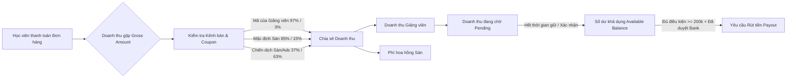

# 📘 BÁO CÁO TOÀN DIỆN KIẾN TRÚC DỰ ÁN & CÔNG THỨC TÀI CHÍNH MINDHUB

> **Dự án:** MindHub — Nền tảng E-Learning & Khóa học Trực tuyến Marketplace  
> **Phiên bản:** 2.0 (Fullstack Laravel 11 API + React 18 / TypeScript / Vite)  
> **Ngày cập nhật:** 18/08/2026  

---

## MỤC LỤC
1. [TỔNG QUAN DỰ ÁN & CÔNG NGHỆ](#1-tổng-quan-dự-án--công-nghệ)
2. [CÔNG THỨC TÍNH TOÁN DOANH THU & TÀI CHÍNH CHI TIẾT](#2-công-thức-tính-toán-doanh-thu--tài-chính-chi-tiết)
   - [2.1. Doanh thu gộp (Gross Merchandise Value - GMV)](#21-doanh-thu-gộp-gross-merchandise-value---gmv)
   - [2.2. Chính sách & Tỷ lệ phân chia hoa hồng (Commission Rules)](#22-chính-sách--tỷ-lệ-phân-chia-hoa-hồng-commission-rules)
   - [2.3. Doanh thu thực nhận của Giảng viên (Instructor Net Revenue)](#23-doanh-thu-thực-nhận-của-giảng-viên-instructor-net-revenue)
   - [2.4. Doanh thu nền tảng / Phí sàn (Platform Fee)](#24-doanh-thu-nền-tảng--phí-sàn-platform-fee)
   - [2.5. Doanh thu đang chờ (Pending Revenue)](#25-doanh-thu-đang-chờ-pending-revenue)
   - [2.6. Doanh thu có thể rút / Số dư khả dụng (Available Balance)](#26-doanh-thu-có-thể-rút--số-dư-khả-dụng-available-balance)
   - [2.7. Điều kiện và Quy trình Rút tiền (Payout Rules)](#27-điều-kiện-và-quy-trình-rút-tiền-payout-rules)
   - [2.8. Xử lý Hoàn tiền & Điều chỉnh (Refund & Chargeback)](#28-xử-lý-hoàn-tiền--điều-chỉnh-refund--chargeback)
3. [KIẾN TRÚC PHÂN HỆ & BẢN ĐỒ CHỨC NĂNG (FE & BE)](#3-kiến-trúc-phân-hệ--bản-đồ-chức-năng-fe--be)
   - [3.1. Phân hệ Public & Khám phá (Discovery & Catalog)](#31-phân-hệ-public--khám-phá-discovery--catalog)
   - [3.2. Phân hệ Học viên & Phòng học (Learner & Classroom)](#32-phân-hệ-học-viên--phòng-học-learner--classroom)
   - [3.3. Phân hệ Giảng viên (Instructor Workspace)](#33-phân-hệ-giảng-viên-instructor-workspace)
   - [3.4. Phân hệ Quản trị viên (Admin Workspace)](#34-phân-hệ-quản-trị-viên-admin-workspace)
4. [CƠ CHẾ LỌC DỮ LIỆU & THUẬT TOÁN XẾP HẠNG](#4-cơ-chế-lọc-dữ-liệu--thuật-toán-xếp-hạng)
5. [TỔNG KẾT & QUY TRÌNH VẬN HÀNH DỮ LIỆU](#5-tổng-kết--quy-trình-vận-hành-dữ-liệu)

---

## 1. TỔNG QUAN DỰ ÁN & CÔNG NGHỆ

MindHub là nền tảng thương mại điện tử khóa học (Marketplace E-learning) kết nối Học viên, Giảng viên và Quản trị viên với mô hình xử lý phân tán:

* **Frontend:**
  - **Framework/Core:** React 18, TypeScript, Vite, React Router DOM v6.
  - **State Management & Data Layer:** Context API (`AppContext`), Custom Hooks (`useClassroom`, `useCourseDetail`, `useApp`), API Client layer tối ưu hóa token và xử lý lỗi đồng bộ.
  - **Giao diện & Trải nghiệm:** Tailwind CSS, Lucide React Icons, Framer Motion, Radix UI / Shadcn.
* **Backend:**
  - **Framework/Core:** Laravel 11, PHP 8.2+, MySQL 8.0.
  - **Authentication & Security:** Custom Session Auth + Bearer Token, Role Middleware (`learner`, `instructor`, `admin`), User Status Verification (`active`, `locked`).
  - **Thanh toán:** Cổng thanh toán trực tuyến VNPay Sandbox & IPN Callback.
  - **Bảo mật nội dung đa phương tiện:** HLS / MP4 Private Streaming qua Signed Route + Dynamic Watermarking định danh học viên.

---

## 2. CÔNG THỨC TÍNH TOÁN DOANH THU & TÀI CHÍNH CHI TIẾT

Hệ thống tài chính của MindHub được thiết kế chặt chẽ theo chuẩn Transactional Ledger trong `RevenueShareService` và `InstructorWithdrawalRepository`.

---

### 2.1. Doanh thu gộp (Gross Merchandise Value - GMV)

**Doanh thu gộp ($\text{Gross Amount}$)** là tổng số tiền thực tế học viên phải trả sau khi đã áp dụng mã giảm giá (nếu có) trên mỗi đơn hàng hợp lệ:

$$\text{Gross Amount} = \text{COALESCE}(\text{order.final\_amount}, \text{order.amount}, 0.0)$$

* **Nếu không có giảm giá:** $\text{Gross Amount} = \text{course.sale\_price} \text{ (hoặc } \text{course.price})$.
* **Nếu có mã giảm giá (`Coupon`):** $\text{Gross Amount} = \max(0, \text{Price} - \text{Discount Amount})$.
* Đơn hàng chỉ được ghi nhận doanh thu khi chuyển sang trạng thái thanh toán thành công:
  $$\text{order.status} \in ['paid', 'completed', 'success', 'paid\_out']$$

---

### 2.2. Chính sách & Tỷ lệ phân chia hoa hồng (Commission Rules)

Hệ thống xác định nguồn bán hàng ($\text{Sale Source}$) để áp dụng tỷ lệ chia sẻ hoa hồng tương ứng:

| Kênh bán hàng (`sale_source`) | Điều kiện kích hoạt | Tỷ lệ Giảng viên ($\%$) | Tỷ lệ Sàn ($\%$) |
| :--- | :--- | :---: | :---: |
| **`instructor_coupon` / `instructor_referral`** | Học viên mua qua mã giảm giá hoặc link giới thiệu của chính Giảng viên sở hữu khóa học. | **97.0%** | **3.0%** |
| **`marketplace_default`** | Học viên tự tìm kiếm và mua trực tiếp trên Marketplace MindHub. | **85.0%** | **15.0%** |
| **`platform_ads` / `admin_campaign`** | Học viên mua từ các chiến dịch quảng cáo trả phí (Google/Facebook Ads) hoặc sự kiện do Sàn tài trợ. | **37.0%** | **63.0%** |

* **Ràng buộc toán học:**
  $$\text{Instructor Percent} + \text{Platform Percent} = 100.0\% \quad (0 \le \text{Rate} \le 100)$$

---

### 2.3. Doanh thu thực nhận của Giảng viên (Instructor Net Revenue)

Số tiền thực tế được ghi có vào tài khoản của Giảng viên cho mỗi đơn hàng được làm tròn 2 chữ số thập phân:

$$\text{Instructor Amount} = \text{round}\left(\text{Gross Amount} \times \frac{\text{Instructor Percent}}{100}, 2\right)$$

*Ví dụ:* Khóa học bán với giá $1.000.000$ VNĐ trên Marketplace mặc định ($85\%$ - $15\%$):
$$\text{Instructor Amount} = 1.000.000 \times \frac{85}{100} = 850.000 \text{ VNĐ}$$

---

### 2.4. Doanh thu nền tảng / Phí sàn (Platform Fee)

Phí dịch vụ mà nền tảng MindHub thu trên mỗi đơn hàng:

$$\text{Platform Fee Amount} = \text{Gross Amount} - \text{Instructor Amount}$$

*Ví dụ:* Đơn hàng $1.000.000$ VNĐ $\rightarrow$ Phí sàn thu $= 1.000.000 - 850.000 = 150.000 \text{ VNĐ}$.

---

### 2.5. Doanh thu đang chờ (Pending Revenue)

Khoản tiền của các đơn hàng mới phát sinh, đang được tạm giữ trong thời gian bảo lưu (Refund Hold Period) để phòng ngừa khiếu nại hoặc yêu cầu hoàn tiền:

$$\text{Pending Revenue} = \sum_{\substack{\text{revenues.status} = '\text{pending}' \\ \text{instructor\_id} = \text{me}}} \text{revenues.instructor\_amount}$$

---

### 2.6. Doanh thu có thể rút / Số dư khả dụng (Available Balance)

Là tổng số tiền Giảng viên có quyền tạo yêu cầu rút về tài khoản ngân hàng ngay tại thời điểm hiện tại:

$$\text{Available Balance} = \sum_{\substack{\text{revenues.status} = '\text{available}' \\ \text{revenues.payout\_id IS NULL} \\ \text{instructor\_id} = \text{me}}} \text{revenues.instructor\_amount}$$

* Khoản tiền đang trong quá trình chuyển tiền ($\text{Scheduled Payout}$):
  $$\text{Scheduled Payout} = \sum_{\substack{\text{status} \in ['ready\_to\_pay', 'queued', 'processing'] \\ \text{user\_id} = \text{me}}} \text{withdraw\_requests.amount}$$
* Tổng số tiền đã thanh toán thành công về tài khoản ngân hàng:
  $$\text{Paid Amount} = \sum_{\substack{\text{status} = 'paid' \\ \text{user\_id} = \text{me}}} \text{withdraw\_requests.amount}$$

---

### 2.7. Điều kiện và Quy trình Rút tiền (Payout Rules)

Để tạo lệnh rút tiền thành công, hệ thống kiểm tra 4 điều kiện tiên quyết:

1. **Ngưỡng rút tối thiểu ($\text{Minimum Payout}$):**
   $$\text{Available Balance} \ge 200.000 \text{ VNĐ}$$
2. **Tài khoản thụ hưởng hợp lệ:** Phải có ít nhất 1 bản ghi `PayoutAccount` có `status = 'active'` và đã được xác minh/duyệt bởi Quản trị viên (`verified`).
3. **Trạng thái tài khoản Giảng viên:** `users.status = 'active'` và `users.locked = false`.
4. **Chu kỳ rút tiền:**
   - **Tự động theo kỳ:** Mở từ ngày **05** đến ngày **10** hàng tháng.
   - **Rút sớm (Early Withdrawal):** Giảng viên gửi yêu cầu trực tiếp qua giao diện, Admin kiểm duyệt và duyệt lệnh.

---

### 2.8. Xử lý Hoàn tiền & Điều chỉnh (Refund & Chargeback)

Khi học viên được chấp thuận hoàn tiền đơn hàng (`handleRefund`):
* **Nếu doanh thu đang ở trạng thái `pending`:** Chuyển `status` thành `refunded`.
* **Nếu doanh thu đã ở trạng thái `available`:** Chuyển `status` thành `reversed`.
* **Nếu doanh thu đã được thanh toán vào kỳ Payout trước:** Hệ thống tự động tạo một bản ghi Doanh thu âm ($\text{Negative Adjustment}$) trong kỳ tiếp theo để cấn trừ:
  $$\text{Gross Amount}_{\text{adj}} = -\text{Gross Amount}_{\text{original}}, \quad \text{Instructor Amount}_{\text{adj}} = -\text{Instructor Amount}_{\text{original}}$$

---

## 3. KIẾN TRÚC PHÂN HỆ & BẢN ĐỒ CHỨC NĂNG (FE & BE)

### 3.1. Phân hệ Public & Khám phá (Discovery & Catalog)

* **Trang chủ (`/`):**
  - Slider Hero Banner (`/api/home` $\rightarrow$ `banners`).
  - Danh mục ngành học nổi bật (`categories`).
  - Top 5 Khóa học tiêu biểu (Featured), Top 5 Khóa học mới nhất (Latest), Top 5 Khóa học giảm giá sâu (Discounted).
  - Top 8 Giảng viên tiêu biểu (Featured Instructors), FAQ và Testimonials từ học viên đã mua khóa học.
* **Tìm kiếm thông minh & Gợi ý tức thì (`/search`, `/api/search/suggestions`):**
  - Gõ từ khóa hiển thị đồng thời kết quả khóa học và danh mục liên quan.
* **Danh sách khóa học & Lọc đa tiêu chí (`/courses`, `/category/:slug`):**
  - Lọc theo từ khóa, danh mục phân cấp (cha/con), trình độ (Cơ bản $\rightarrow$ Nâng cao), khoảng giá, ngôn ngữ và sắp xếp đa chiều.
* **Lộ trình học tập (`/roadmaps`):**
  - Gom các khóa học theo Career Path (Frontend, Backend, AI Engineer...) giúp học viên có định hướng học tập từ đầu.

---

### 3.2. Phân hệ Học viên & Phòng học (Learner & Classroom)

* **Chi tiết khóa học & Video Preview (`/courses/:courseId`):**
  - Xem thông tin giảng viên, đề cương bài học, đánh giá sao, và học thử các bài học gắn cờ `is_preview = true`.
* **Giỏ hàng & Thanh toán VNPay (`/cart`, `/checkout`):**
  - Áp dụng mã Coupon, tính toán tổng tiền thanh toán thời gian thực, tích hợp cổng thanh toán VNPay và tự động kích hoạt khóa học khi nhận IPN.
* **Phòng học trực tuyến chuyên sâu (`/learn/:courseId`):**
  - **Video Streaming an toàn:** Tạo Signed URL tạm thời kèm Watermark chống ghi trộm màn hình.
  - **Theo dõi tiến độ:** Tự động lưu vị trí giây đang xem (`last_watched_second`), tính `%` hoàn thành khóa học, tự động mở khóa bài tiếp theo.
  - **Ghi chú bài học (`Notes`):** Thêm ghi chú kèm mốc thời gian video.
  - **Cấp chứng chỉ (`/certificates`):** Tự động phát hành chứng chỉ PDF/ảnh khi đạt $100\%$ bài học và Quiz.
* **Khu vực cá nhân:**
  - `MyCoursesPage` (`/my-courses`): Quản lý khóa học đang học / đã hoàn thành.
  - `FavoritesPage` (`/favorites`): Danh sách khóa học yêu thích (`Wishlist`).
  - `AchievementsPage` (`/achievements`): Điểm danh chuỗi ngày học (`Streak`) và Heatmap thời gian học.
  - `PurchaseHistoryPage` (`/purchase-history`): Lịch sử đơn hàng, hóa đơn điện tử.

---

### 3.3. Phân hệ Giảng viên (Instructor Workspace)

* **Tổng quan (`/instructor/dashboard`):**
  - Thống kê doanh thu tháng, học viên mới, đánh giá trung bình và biểu đồ phân tích tăng trưởng.
* **Quản lý khóa học (`/instructor/courses`):**
  - Quản lý khóa học của cá nhân, tạo bản nháp (`draft`), gửi duyệt (`pending_approval`), cập nhật video/tài liệu/quiz.
* **Quản lý Tài chính & Rút tiền (`/instructor/withdrawals`):**
  - Báo cáo chi tiết từng dòng doanh thu theo đơn hàng, kênh bán và tỷ lệ hoa hồng.
  - Liên kết tài khoản ngân hàng thụ hưởng (`PayoutAccount`), gửi yêu cầu rút tiền về ngân hàng.
* **Tương tác & Học viên (`/instructor/students`, `/instructor/questions`):**
  - Quản lý danh sách học viên ghi danh, giải đáp câu hỏi Q&A theo từng bài giảng.

---

### 3.4. Phân hệ Quản trị viên (Admin Workspace)

* **Dashboard Trung tâm (`/admin/dashboard`):**
  - Báo cáo tài chính toàn sàn (Tổng GMV, Doanh thu sàn, Doanh thu trả giảng viên, Số lượng đơn hàng, Tỷ lệ chuyển đổi).
* **Quản lý Người dùng (`/admin/users`):**
  - Quản lý phân quyền RBAC (`learner`, `instructor`, `admin`), khóa/mở khóa tài khoản vi phạm.
* **Kiểm duyệt Khóa học (`/admin/courses`, `/admin/course-reviews`):**
  - Xem trước toàn bộ nội dung, phê duyệt (`published`) hoặc từ chối kèm lý do phản hồi (`rejected`).
* **Cấu hình Danh mục & Banner (`/admin/categories`, `/admin/banners`):**
  - Xây dựng cây danh mục đa cấp, cấu hình thứ tự ưu tiên hiển thị trên trang chủ.
* **Xử lý Rút tiền & Quyết toán (`/admin/withdrawals`, `/admin/revenues`):**
  - Kiểm tra đối soát số dư giảng viên, xác nhận chuyển khoản ngân hàng và hoàn tất lệnh rút tiền.
* **Duyệt nâng cấp Giảng viên (`/admin/instructor-upgrades`):**
  - Kiểm tra hồ sơ chuyên môn và phê duyệt tài khoản học viên lên giảng viên.

---

## 4. CƠ CHẾ LỌC DỮ LIỆU & THUẬT TOÁN XẾP HẠNG

### 4.1. Điều kiện hiển thị Khóa học Công khai (Public Scope)

Để xuất hiện trên trang chủ, danh mục hoặc tìm kiếm, khóa học phải thỏa mãn đồng thời:
$$\begin{cases}
\text{courses.status} = '\text{published}' \\
\text{courses.deleted\_at IS NULL} \\
\text{instructor.status} = '\text{active}' \\
\text{instructor.locked} = 0 \text{ hoặc NULL}
\end{cases}$$

### 4.2. Thuật toán Xếp hạng Nổi bật (Featured Score Algorithm)

Với các khóa học có từ 10 lượt ghi danh trở lên trong 90 ngày gần nhất:

$$\text{Featured Score} = 0.4 \times \left(\frac{\text{Enrollments}_{90\text{d}}}{\text{E}_{\max}}\right) + 0.4 \times \left(\frac{\text{Avg Progress}}{100}\right) + 0.2 \times \left(\frac{\text{Avg Rating}}{5}\right)$$

*Thứ tự ưu tiên hiển thị:*
1. Cờ ghim thủ công của Admin (`courses.is_featured DESC`).
2. Điểm $\text{Featured Score DESC}$.
3. Tổng số học viên toàn thời gian (`enrollments_count DESC`).
4. Điểm đánh giá trung bình (`average_rating DESC`).

---

## 5. TỔNG KẾT & QUY TRÌNH VẬN HÀNH DỮ LIỆU

Hệ thống MindHub vận hành theo chu trình khép kín:
1. **Giảng viên** soạn thảo khóa học $\rightarrow$ Gửi duyệt $\rightarrow$ **Admin** phê duyệt và phát hành.
2. **Khách hàng** tìm kiếm qua bộ lọc đa chiều $\rightarrow$ Đặt mua và thanh toán qua **VNPay**.
3. **Hệ thống** tự động kích hoạt phòng học, stream video bảo mật, ghi nhận tiến độ học tập và cấp chứng chỉ.
4. **Hệ thống tài chính** tự động tách doanh thu gộp thành phần của Giảng viên và Phí sàn $\rightarrow$ Quản lý qua tài khoản số dư $\rightarrow$ **Giảng viên** tạo lệnh rút tiền $\rightarrow$ **Admin** đối soát và giải ngân.

---
*Tài liệu được trích xuất trực tiếp từ mã nguồn thực thi của hệ thống MindHub Backend & Frontend.*
